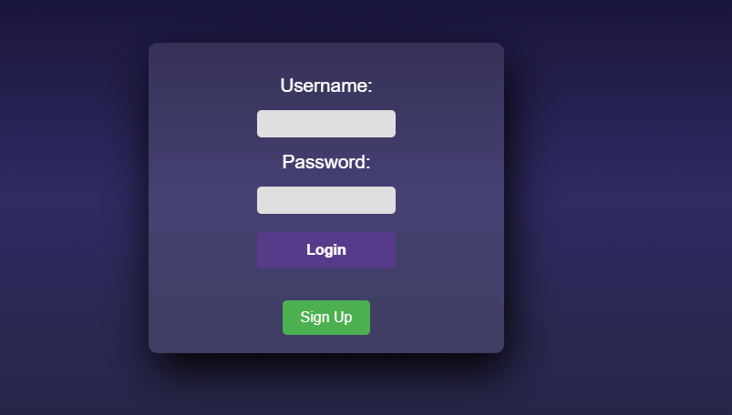
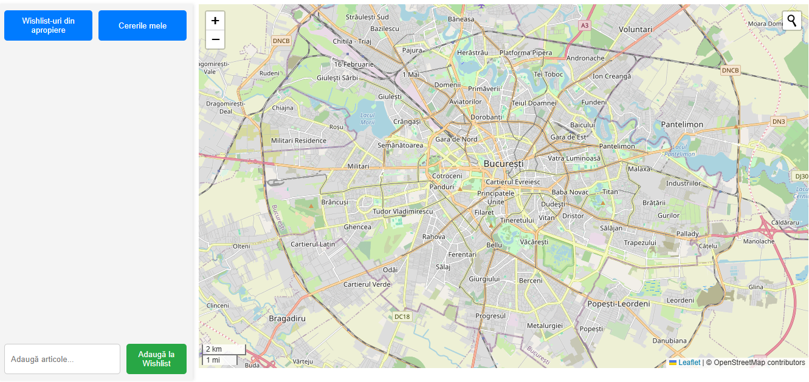
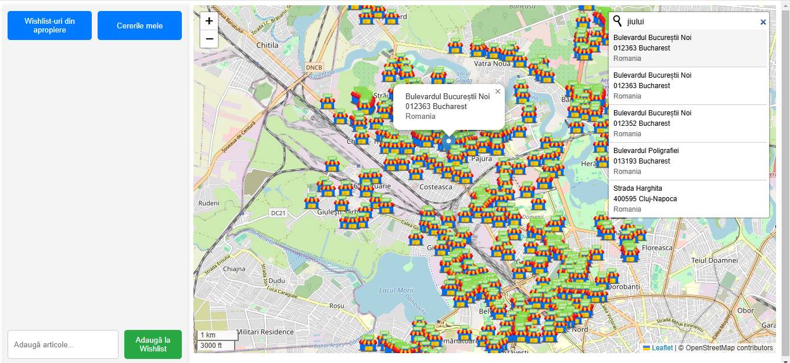
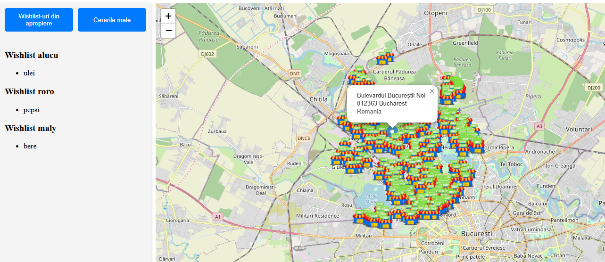

# Kartpool - Aplicatie Web pentru Managementul Datelor Geospatiale

Kartpool este o aplicatie web construita cu Django (backend) si HTML/CSS (frontend) care permite gestionarea si vizualizarea magazinelor din Bucuresti pe o harta. Aplicatia utilizeaza date colectate via Overpass Turbo si afiseaza magazinele pe o raza de 5 km, precum si wishlist-urile clientilor pe o raza de 3 km.

---

## **Tehnologii Folosite**

### Backend
- **Python**: Limbajul principal.
- **Django**: Framework web pentru backend.
- **PostgreSQL + PostGIS**: Baza de date pentru stocarea datelor geospatiale.
- **GeoDjango**: Extensie Django pentru lucrul cu date geospatiale.
- **GDAL**: Librarie pentru manipularea datelor geospatiale.

### Frontend
- **HTML/CSS**: Interfata utilizator.
- **JavaScript**: Pentru logica de afisare a hartii si a datelor.
- **OpenLayers/Leaflet**: Pentru vizualizarea hartii (optional, daca este cazul).

### Instrumente de Colectare a Datelor
- **Overpass Turbo**: Folosit pentru extragerea datelor despre magazinele din Bucuresti.

### Alte Tool-uri
- **Docker**: Pentru containerizare.
- **Docker Compose**: Pentru gestionarea serviciilor.

---

## **Cum sa Rulezi Proiectul**

### Cerinte Preliminare
- [Docker](https://www.docker.com/get-started)
- [Docker Compose](https://docs.docker.com/compose/install/)

### Pasii de Configurare

1. **Cloneaza repository-ul**:
   ```bash
   git clone https://github.com/roro11fr/kartpool.git
   cd kartpool

## Screenshot-uri

### 1. **Pagina de Login / Signup**
Pagina unde utilizatorii se pot autentifica sau crea un cont pentru a accesa wishlist-urile si magazinele.



### 2. **Vedere Initiala pe Harta**
Aceasta este harta la inceput, cand aplicatia este incarcata pentru prima data, fara a cauta vreo locatie.



### 3. **Cautare Locatie**
Dupa ce faci o cautare pentru o locatie, harta se umple cu magazinele aflate pe o raza de 5 km in jurul acelei locatii.



### 4. **Wishlist-uri Apropiate**
Tab-ul "Wishlist-uri Aproape" afiseaza toate wishlist-urile apropiate ale utilizatorilor din zona, aflate pe o raza de 3 km.




## Functionalitate Noua Adaugata

### Estimate Time Microservice (`storemetrics`)
Am adăugat o componentă de tip microserviciu în cadrul proiectului, denumită `storemetrics`, care expune un endpoint REST asincron pentru estimarea timpului necesar deplasării.

#### 🔹 Endpoint:
```
POST /api/storemetrics/estimate-time/
```

#### 🔹 Ce face:
- Primește un JSON cu parametrii:
  - `mode`: tipul de deplasare (`walk` sau `bike`)
  - `distance_km`: distanța în kilometri
- Validează inputul cu `Pydantic` (inclusiv pattern regex)
- Simulează operație asincronă cu `asyncio.sleep`
- Returnează timpul estimat în minute
- A fost scris un test unitar complet pentru validarea funcționalității

#### 🔹 Tehnologii folosite:
- `Pydantic`: validare input
- `asyncio`: simulare asincronă
- `flake8` + `black`: linting și format automat
- `Django TestCase`: test unitar scris și validat